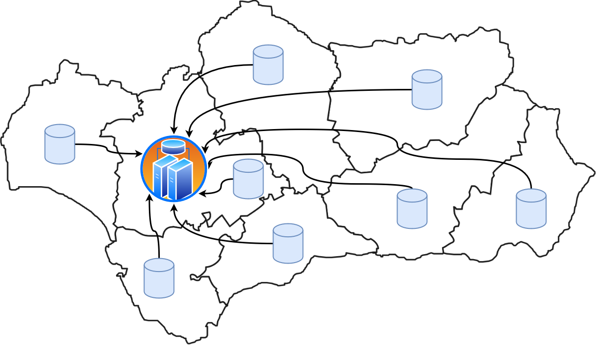

```{r setup, include = FALSE}
knitr::opts_chunk$set(
  collapse = TRUE,
  comment = "#>"
)
```

## Introducción
En este vignette, hablaremos sobre problemas que se resuelven a través de técnicas de computación paralela y de computación distribuida. 

El paralelismo es la simple aplicación de múltiples CPU a un único problema. Más formalmente, podemos definir el paralelismo como la forma de computación en la cual varios cálculos pueden realizarse simultáneamente, basado en el principio de dividir los problemas grandes para obtener varios problemas pequeños (que se presuponen más fáciles de resolver), que serán solucionados en paralelo. 

Las ventajas del paralelismo las podemos resumir en: la capacidad de resolver los problemas que no pueden ser manejados con una única CPU, permitir la ejecución de problemas con un alto nivel de complejidad, la velocidad en la ejecución al usar varias CPU y su capacidad para ofrecer un balance entre coste y rendimiento.

Sin embargo, también, tiene inconvenientes entre las que destaca: la gran cantidad de ciclos de procesamiento y de datos que son necesarios para poder aprovechar esta técnica, los problemas de seguridad que se puedan generar ya que se necesita un software y hardware específico para la computación paralela y debido a las múltiples CPU, puede ser difícil conseguir una buena sincronización y comunicación entre los procesos.


La computación distribuida es un modelo para resolver problemas de computación masiva utilizando un gran número de ordenadores organizados en clústeres incrustados en una infraestructura de telecomunicaciones distribuida. Podemos definir la computación distribuida como el modelo informático que permite hacer grandes cálculos utilizando miles de ordenadores. Este sistema se basa en repartir la información a través de Internet mediante un software a diferentes ordenadores, que van resolviendo los cálculos y, una vez tienen el resultado, lo envían al servidor. 

Las ventajas de la computación distribuida son: la distribución geográfica de los ordenadores, la alta velocidad de cómputo, la compartición de los recursos, la tolerancia a fallos y la modularidad para que el sistema sea independiente.

Los inconvenientes de la computación distribuida son: la escalabilidad cuando aumenta la demanda del sistema, la heterogeneidad, la gestión de los recursos, la dificultad de conseguir la transparencia total del sistema distribuido, las altas medidas de seguridad y privacidad que se deben tomar y los problemas de sincronización e interbloqueo. 

## Problema específico
A continuación se va a presentar un problema de uso de los paquetes *snow* y *Rmpi*.

Supongamos que nos encontramos a finales de año, donde la mayoría de empresas y
administraciones analizan su actividad realizada durante el año. En estos análisis se
calculan indicadores estadísticos que permitan representar resúmenes y cualidades de los
resultados obtenidos. Estos procesos cobran significada importancia en el ámbito
hospitalario. 

Los indicadores estadísticos no solo miden el rendimiento de los trabajadores en una 
organización, sino que en ámbitos como el sanitario permiten monitorizar las actividades,
resultados y listas de espera de un hospital o todo un sistema sanitario. Cabe destacar
que, aunque estos datos estadísticos se calculan continuamente, incluso en tiempo real o
en un período de pocos días, sí es cierto que a final del período de curso de actividad
se suelen agrupar para realizar un análisis extenso y exploratorio de un gran conjunto
de centros sanitarios, como el Sistema Andaluz de Salud.

Por este motivo, es posible que en esos períodos sea necesario calcular ciertos parámetros
en cada centro y enviarlos al nodo desde donde puedan ser accedidos por un departamento
administrativo general para, posteriormente, aplicar más cálculos o agruparlos
de manera que puedan ser analizados más fácilmente desde diferentes vistas. Así, es un
requerimiento que los datos
que se obtienen de los centros sean calculados homogéneamente, evitando incoherencias o
faltas de integridad. Esta homogeneidad en los cálculos se puede obtener mediante una 
red de computación, donde se puede distribuir el trabajo entre diferentes nodos configurados
y conectados a esta red. Es más, normalmente estos nodos no tienen por qué tener capacidades
o ser homogéneos entre sí. Podrían tratarse de ordenadores o servidores con distintos
sistemas operativos, características *hardware* completamente distintas o incluso ser 
virtuales, dependiendo de cada centro sanitario.

{width=50%}

## Paquetes y funciones que permiten resolver el problema


## Ejemplo 1

## Ejemplo 2


## Ejemplo 3
