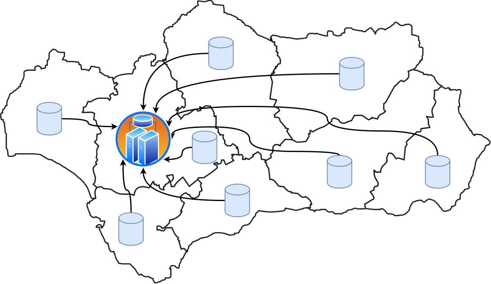

```{r setup, include = FALSE}
knitr::opts_chunk$set(
  collapse = TRUE,
  comment = "#>"
)
```

## Introducción
En este vignette, hablaremos sobre problemas que se resuelven a través de técnicas de computación paralela y de computación distribuida. 

El paralelismo es la simple aplicación de múltiples CPU a un único problema. Más formalmente, podemos definir el paralelismo como la forma de computación en la cual varios cálculos pueden realizarse simultáneamente, basado en el principio de dividir los problemas grandes para obtener varios problemas pequeños (que se presuponen más fáciles de resolver), que serán solucionados en paralelo. 

Las ventajas del paralelismo las podemos resumir en: la capacidad de resolver los problemas que no pueden ser manejados con una única CPU, permitir la ejecución de problemas con un alto nivel de complejidad, la velocidad en la ejecución al usar varias CPU y su capacidad para ofrecer un balance entre coste y rendimiento.

Sin embargo, también, tiene inconvenientes entre las que destaca: la gran cantidad de ciclos de procesamiento y de datos que son necesarios para poder aprovechar esta técnica, los problemas de seguridad que se puedan generar ya que se necesita un software y hardware específico para la computación paralela y debido a las múltiples CPU, puede ser difícil conseguir una buena sincronización y comunicación entre los procesos.


La computación distribuida es un modelo para resolver problemas de computación masiva utilizando un gran número de ordenadores organizados en clústeres incrustados en una infraestructura de telecomunicaciones distribuida. Podemos definir la computación distribuida como el modelo informático que permite hacer grandes cálculos utilizando miles de ordenadores. Este sistema se basa en repartir la información a través de Internet mediante un software a diferentes ordenadores, que van resolviendo los cálculos y, una vez tienen el resultado, lo envían al servidor. 

Las ventajas de la computación distribuida son: la distribución geográfica de los ordenadores, la alta velocidad de cómputo, la compartición de los recursos, la tolerancia a fallos y la modularidad para que el sistema sea independiente.

Los inconvenientes de la computación distribuida son: la escalabilidad cuando aumenta la demanda del sistema, la heterogeneidad, la gestión de los recursos, la dificultad de conseguir la transparencia total del sistema distribuido, las altas medidas de seguridad y privacidad que se deben tomar y los problemas de sincronización e interbloqueo. 

## Problema específico
A continuación se va a presentar un problema de uso de los paquetes *snow* y *Rmpi*.

Supongamos que nos encontramos a finales de año, donde la mayoría de empresas y
administraciones analizan su actividad realizada durante el año. En estos análisis se
calculan indicadores estadísticos que permitan representar resúmenes y cualidades de los
resultados obtenidos. Estos procesos cobran significada importancia en el ámbito
hospitalario. 

Los indicadores estadísticos no solo miden el rendimiento de los trabajadores en una 
organización, sino que en ámbitos como el sanitario permiten monitorizar las actividades,
resultados y listas de espera de un hospital o todo un sistema sanitario. Cabe destacar
que, aunque estos datos estadísticos se calculan continuamente, incluso en tiempo real o
en un período de pocos días, sí es cierto que a final del período de curso de actividad
se suelen agrupar para realizar un análisis extenso y exploratorio de un gran conjunto
de centros sanitarios.

Por este motivo, es posible que en esos períodos sea necesario calcular ciertos parámetros
en cada centro y enviarlos al nodo desde donde puedan ser accedidos por un departamento
administrativo general para, posteriormente, aplicar más cálculos o agruparlos
de manera que puedan ser analizados más fácilmente desde diferentes vistas. Así, es un
requerimiento que los datos
que se obtienen de los centros sean calculados homogéneamente, evitando incoherencias o
faltas de integridad. Esta homogeneidad en los cálculos se puede obtener mediante una 
red de computación, donde se puede distribuir el trabajo entre diferentes nodos configurados
y conectados a esta red. Es más, normalmente estos nodos no tienen por qué tener capacidades
o ser homogéneos entre sí. 

{width=50%}

## Paquetes y funciones que permiten resolver el problema

```{r eval = FALSE}
library(Rmpi)
```

**RMPI** es un paquete que proporciona enlaces a MPI para el lenguaje de programación R. 
De la misma forma que se puede escribir código paralelo en otros lenguajes como C o Fortran, los códigos de R también pueden ejecutarse en paralelo a través de múltiples procesadores o nodos. 
La interfaz de paso de mensajes o **PMI** (*Message Passing Interface*) es un estándar que define la sintaxis y la semántica de las funcioines contenidas en una biblioteca de paso de mensajes diseñada para ser usada en programas que exploten la existencia de múltiples procesadores. 
Siendo más específicos, en realidad MPI se trata de un ''estándar por consenso'', el cual fue diseñado originalmente en un foro abierto. 
Con esto dicho, cabe aclarar que MPI no es un verdadeo estándar, debido a que no fue emitido por una organización de estándares como ISO o la IEEE, aunque es ampliamente usado debido a que es código libre. 

La ventaja de MPI sobre otras bibliotecas de paso de mensajes, es que los programas que utilizan la biblioteca son portables (MPI ha sido implementado para casi toda arquitectura de memoria distribuida), y rápidos (cada implementación de la biblioteca ha sido optimizada para el hardware en la que se ejecuta).

En resumen, podemos resumir las características de MPI en: estandarización, portabilidad, buenas prestaciones, amplia funcionalidad y existencia de implementaciones libres. 
La especificación detalla las funciones que se pueden utilizar, lo cual puede variar de una implementación a otra. 
El usuario escribirá su aplicación como un proceso secuencial del que selanzarán varias instancias que cooperan entre sí. 
Es importante destacar que los procesos invocan diferentes funciones MPI que permiten:
  * iniciar, gestionar y finalizar procesos MPI
  * comunicar datos entre dos procesos
  * realizar operaciones de comunicación entre grupos de procesos
  * crear tipos arbitrarios de datos

```{r eval = FALSE}
library(snow)
```

**SNOW** (*Simple Network Of Workstations*) es una librería que se ha construido sobre RMPI, aunque no es necesario estar familiarizado con MPI para usar esta librería. 
Es una buena opción para paralelizar aplicaciones que pueden usar más de un núcleos (*core*). 
Se establece un modelo de *manager*/trabajador, donde un proceso (*manager*) controla al resto de procesos, que son los que realmente realizan el trabajo. 
Estos ''trabajadores'' comunican sus resultados de vuelta al proceso *manager*, que podrá realizar más trabajo sobre los datos que se han añadido. 

## Ejemplo 1

En este ejemplo se va a mostrar la manera en la que *rmpi* permite facilitar la extracción homogénea de los datos desde diferentes nodos y su transmisión al nodo maestro, que se correspondería, por ejemplo, con el de un departamento administrativo. 

En primer lugar establecesmo los esclavos.

```{r}
if (!is.loaded("mpi_initialize")) {
  library("Rmpi")
}
usize <- mpi.universe.size()
ns <- usize - 1 # nslaves= requested number of processors - 1
mpi.spawn.Rslaves(nslaves=ns)
```

Establecemos un array de la variable
 
```{r}
var <- c('182.219.165.102', '171.71.62.247', '210.57.40.92','253.51.230.149', '203.89.85.9')

db_names<-c('db_pacientes', 'pacnts_bd', 'pacientes', 'PacientesDB', 'pacientes_db')
```

La raíz envía el estado de las variables y los parámetros a otros rangos

```{r}
# Root sends state variables and parameters to other ranks
mpi.bcast.data2slave(var, comm = 1, buffunit = 100)
# Get the rank number of that processor
mpi.bcast.cmd(id <- mpi.comm.rank())
# Check if each rank can use its own value
mpi.remote.exec(paste("The variable on rank ",id," is ", var[id]))

# Root orders other ranks to calculate
mpi.bcast.cmd(output <- db_names[id])
# Root orders other ranks to gather the output
mpi.bcast.cmd(mpi.gather(output, 2, double(1)))

# Root gathers the output from other ranks
mpi.gather(double(1), 2, double(usize))

# Close down and quit
mpi.close.Rslaves(dellog = FALSE)
mpi.quit()
```

## Ejemplo 2


## Ejemplo 3
En este siguiente ejemplo se va a mostrar la manera en la que *snow* permite facilitar la extracción homogénea de los 
datos desde diferentes nodos y su transmisión al nodo maestro, que se correspondería, por ejemplo, con el de un
departamente administrativo.

Sea la siguiente sentencia la definición de las direcciones IP de las nodos sobre los que se va a realizar la operación
de distribución:
```{r}
nodes_addr<-c('182.219.165.102', '171.71.62.247', '210.57.40.92','253.51.230.149', '203.89.85.9')
```

A continuación, se define el nombre de la base de datos desde donde se va a extraer la información para cada nodo, pues,
como ya se ha comentado anteriormente, los sistemas de cada nodo pueden ser heterógeneos entre sí:
```{r}
db_names<-c('db_pacientes', 'pacnts_bd', 'pacientes', 'PacientesDB', 'pacientes_db')
```
De esta manera, al nodo cuya dirección IP es *182.219.165.102* la base de datos donde almacena los datos requeridos se llama
*db_pacientes*.

Una vez definido desde dónde se va a acceder los datos en cada nodo, debemos definir la
función que nos permita acceder a los datos y devolverlos al nodo maestro, por ejemplo, 
en forma de *dataframe*. Por cuestiones de extensibilidad, no se especifica el método de 
acceso a la base de datos en cada nodo:
```{r eval = FALSE}
fetchData<-function(db_name) {
  
  # Conexión con la base de datos
  # Comprobación de la existencia de los datos
  # Acceso a los datos
  # Transformación a dataframe
  return df
}
```

Ahora se define el *cluster* distribuido y se aplica la función anteriormente definida
mediante *clusterApply*:
```{r eval = FALSE}
cl<-makeSOCKcluster(nodes_addr)
results<-clusterApply(cl, db_names, fecthData)
```
Y en la variable *results* se obtendría los datos en forma de *dataframe* para cada nodo.